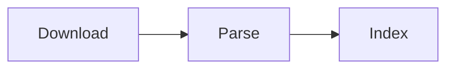
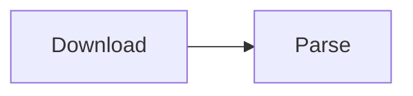

# minidagster

This is a [Dagster](https://dagster.io/) project scaffolded with [`dagster project scaffold`](https://docs.dagster.io/getting-started/create-new-project).

## Getting started

First, install your Dagster code location as a Python package. By using the --editable flag, pip will install your Python package in ["editable mode"](https://pip.pypa.io/en/latest/topics/local-project-installs/#editable-installs) so that as you develop, local code changes will automatically apply.

```bash
pip install -e ".[dev]"
```

Then, start the Dagster UI web server:

```bash
dagster dev
```

## Info

### Linear with partitions

Linear graph of assets where every asset has the same partition definition.



- What happens when I materialize partition `X` of the `Download` asset?
  1. Partition `X` of `Download` will materialize
  1. Partition `X` of `Parse` will materialize
  1. Partition `X` of `Index` will materialize
- What happens when I materialize partition `X` of the `Parse` asset? Or any
other asset in the middle of the graph.
  1. Partition `X` of `Parse` will materialize
  1. Partition `X` of `Index` will materialize


### Linear without partitions

Linear graph of assets where every asset doesn't have any partition definition.


- What happens when I materialize the `Download` asset?
  1. `Download` will materialize
  1. `Parse` will materialize
  1. `Index` will materialize
- What happens when I materialize the `Parse` asset? Or any other asset in the 
middle of the graph.
  1. `Parse` will materialize
  1. `Index` will materialize


### Parent with partitions

Linear graph of assets where the parent asset has partitions but the child
asset does not.



We need to do some work to make this work.